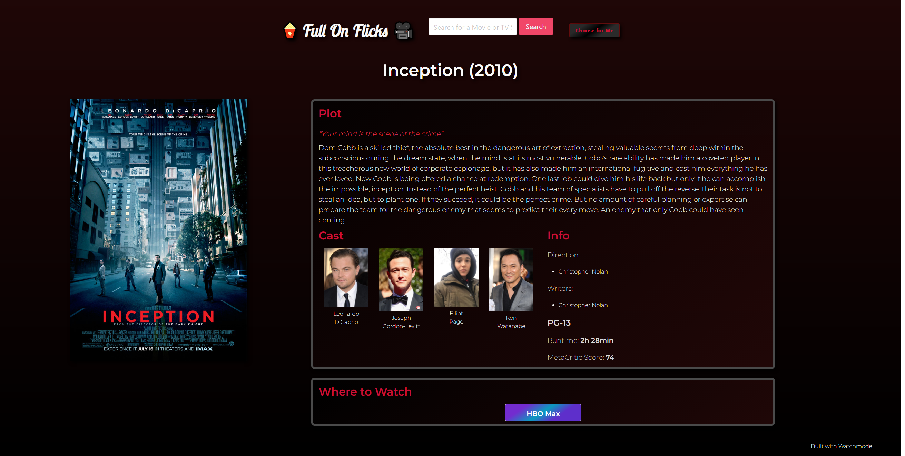

# 🎥🎬Full On Flicks🍿🎞
>For the real filmheads

## 📃 Description
Full on Flicks is a webpage built to allow users to search for movies/TV series' to see who was in it, who made it, what the plot is, etc. Along with this search, the web page will let you know what streaming services are carrying this movie/TV series right now so you can promtply get to watching it.  
*Bonus: a 'choose for me button' that will select a random search term for you* 

## 👤 User Story
AS A movie buff 
I WANT to search for movies to watch and also to search for info on movies 
SO THAT I can watch new things based on casting or critic scores 

## ✅ Acceptance Criteria
GIVEN a webpage with a movie search feature 
WHEN I search for a movie 
THEN I am presented with information about that movie, including: date it was made, who was cast in it, who directed, etc. 
 
WHEN I search for a new movie 
THEN my last searched movie is an easily clickable button, in a list of my other searched cities (maybe last 3-5 searches) 
 
WHEN I am looking at a movie's search results 
THEN I am presented with information on where that movie is available to stream 
 
WHEN I click on the 'Choose For Me' button 
THEN I am presented with a randomly searched term and it's results on the page 
 
WHEN I resize the page or view the page from different sized devices 
THEN the page has a responsive design that fits the screen sizes well 

## 🔗 APIs Used
[IMDb API](https://imdb-api.com/)  
[Watchmode API](https://api.watchmode.com/)

## 🔨 Built With
- HTML
- CSS
- JavaScript
- [Bulma](https://bulma.io/documentation/)

## 📸 Screenshot

## ⚙ Contribution
*Made by*
- **[dn691997](https://github.com/dn691997/Full-On-Flicks/commits?author=dn691997)**
- **[JCarlen13](https://github.com/JCarlen13)**
- **[Tneswick](https://github.com/Tneswick)**
